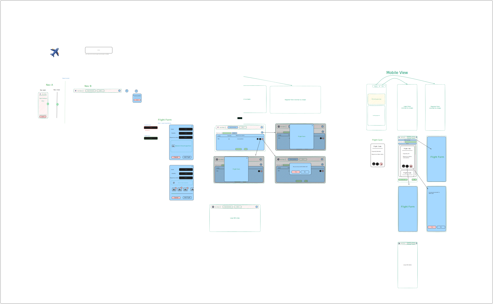

# Axis flights

## Introduction

Axis Flights is a front-end project focused on building a dynamic and user-friendly interface. The task includes several key features:

- **Authentication**: Secure user login and management.
- **CRUD Operations**: Full support for creating, reading, updating, and deleting data.
- **Responsive Design**: Ensures a seamless experience across different devices and screen sizes.

## prerequisites

- NodeJS

## Mock design



## Installation & Usage

1. Open terminal
2. Use the following command

```shell
git clone https://github.com/ahmedgaafer/axis-flights.git
cd axis-flights
npm i
```

3. I Created a simple data generation script [Here](./dataGenerator.ts) To use it type this in console

> NOTE: You can change the generator settings through the script line 152

```shell
npm run server:dev
```

and wait for it work. Then in another terminal cd to the same path

```shell
npx tsx dataGenerator.ts
```

4. to run the app (Front & back end) run the following command
   > Make sure that you close the server opened in step 3

```shell
npm run start
```

5. Open the front-end app from [HERE](http://localhost:5001/).

## Design

- To preview the mock design of the project please go [HERE](https://excalidraw.com/#json=jnOg1MtuUwiYPrOdRZB5Y,dZK930roeIFZrARoDzPhUg)

- The website will switch dark and light theme automatically based on system preferences.
